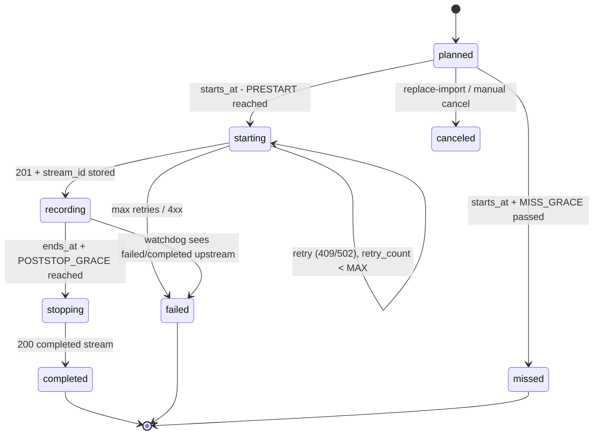
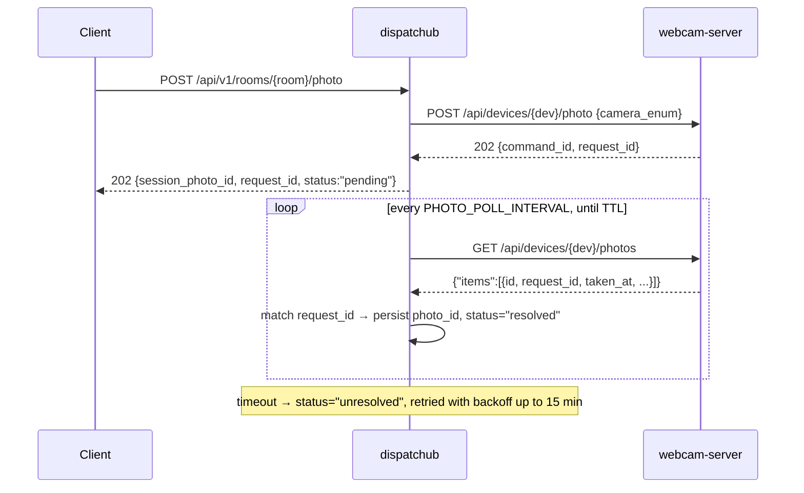

# smartclass-dispatchub — Implementation Plan

Go service that owns the classroom recording schedule for smartclass: it imports course timetables
(课表), drives `smartclass-webcam-server` to start/stop recordings and take snapshots, and persists
the webcam-server-generated `stream id` / `photo id` in PostgreSQL so recordings stay addressable
forever. All authenticated access is delegated to `nsc-teamusers`.

Status: design proposal. No code exists yet in this directory.

---

## 1. Scope

### In scope

1. **Timetable import API** (CSV over multipart) — terms, 节次 tables, course/teacher/room rows,
   materialized into concrete recording sessions. Dry-run + validation report + re-import.
2. **Room binding** — `room_code` → (`device_id`, `camera_enum`) bindings against webcam-server devices.
3. **Recording control** — start/stop recording, camera switch, snapshot; both schedule-driven
   (automatic) and manual (mid-session API).
4. **Persistence** — `stream_id` and `photo_id` (plus their metadata) stored in PostgreSQL.
5. **Scheduler** — timer loop that starts recordings before each session and stops them at the end,
   with reconciliation against webcam-server drift.
6. **Auth** — teamusers JWT verification + remote permission checks, via the official Go SDK.
7. **Documentation site** — VitePress site under `docs/` with an OpenAPI document generated from the
   live router, built by pnpm and published to GitHub Pages by CI (§12). Required deliverable, same
   toolchain as `smartclass-webcam-server` and `nsc-msghub`.

### Out of scope

- Media storage / transcoding / remuxing — webcam-server writes segments to nsc-filehouse or S3;
  dispatchub stores only ids and asks webcam-server for short-lived download URLs on demand.
- Device provisioning in webcam-server (`POST /api/devices`, token rotation) — stays with the
  existing admin flow. dispatchub only reads devices.
- Live video preview — webcam-server exposes **no** MJPEG/HLS/RTSP endpoint (see §11, risk R3).
- Attendance analytics, transcripts, notifications.

---

## 2. Upstream contracts (verified against source)

### 2.1 webcam-server (`D:/源码/smartclass/smartcalss-webcam-server`, module `github.com/crazy4chicken/smartclass-webcam-server`)

No global path prefix; default listen `:8080` (`WEBCAM_LISTEN_ADDR`). All `/api` routes require
`Authorization: Bearer <teamusers access token>` and a permission `cam:<action>:<scope>`
(`<action> ∈ {read, manage, control}`, `<scope> ∈ {own, team, any}`).

| Method | Path | Permission | Request | Success |
| --- | --- | --- | --- | --- |
| GET | `/api/devices/{device_id}/` | `cam:read:` | — | `{…Device, "online", "cameras":[…]}` |
| GET | `/api/devices/{device_id}/streams` | `cam:read:` | — | `{"items":[Stream]}` newest first |
| GET | `/api/devices/{device_id}/photos` | `cam:read:` | — | `{"items":[Photo]}` newest first |
| GET | `/api/streams/{stream_id}/` | `cam:read:` | — | `Stream` + `"segments":[Segment+download_url]` |
| GET | `/api/photos/{photo_id}/` | `cam:read:` | — | `Photo` + `"download_url"` |
| POST | `/api/devices/{device_id}/recording/start` | `cam:control:` | `{"camera_enum":N}` | **201** `Stream` (`"id"`, `"status":"active"`), `Location: /api/streams/{id}` |
| POST | `/api/devices/{device_id}/recording/stop` | `cam:control:` | `{"camera_enum":N}` | **200** `Stream` (`"status":"completed"`, `"ended_at"`) |
| POST | `/api/devices/{device_id}/camera/switch` | `cam:control:` | `{"camera_enum":N}` | **202** `{"command_id","camera_enum"}` |
| POST | `/api/devices/{device_id}/photo` | `cam:control:` | `{"camera_enum":N}` | **202** `{"command_id","request_id","camera_enum"}` |

Facts that shape the design (all verbatim from source):

- **stream id** is the `id` field of the stream object returned by `recording/start` (26-char ULID,
  `TEXT PRIMARY KEY` in webcam-server's own Postgres — stable across restarts).
- **photo id** is *not* returned by the capture call. `POST …/photo` returns only `request_id`;
  the photo id is minted server-side on upload and must be recovered by polling
  `GET /api/devices/{device_id}/photos` and matching `request_id`. There is no lookup-by-`request_id`
  endpoint and **no webhook/callback of any kind** — polling is the only option.
- `storage_key` is never exposed; segments are reachable only through `download_url`, minted per
  response with a 15-minute TTL. Never persist `download_url`.
- Error semantics we must map: **409** `device "…" is offline` (all commands), **409**
  `camera_enum N is already streaming on device "…"` (start), **404** `no active stream for camera_enum N`
  (stop), **400** `camera_enum N is not registered for device …`, **502** `device connection is unavailable`.
  Errors are RFC 9457 `application/problem+json`.
- Crash caveat: webcam-server never reconciles `streams` at startup. A hard restart leaves rows
  `status='active'`, and the partial unique index then makes the next `recording/start` answer 409.
  dispatchub must handle this (§8.4).
- Device disconnect finalizes an un-stopped stream as `failed`; already-flushed segments remain listable.

### 2.2 nsc-teamusers

- EdDSA (Ed25519) JWT issuer; JWKS at `{base}/.well-known/jwks.json`.
- `POST /auth/login {username,password}` → `{access_token, refresh_token, expires_in}` (access TTL 600 s).
- `POST /auth/client-credentials {client_id, client_secret}` → `{access_token, expires_in}` — the
  service-to-service credential dispatchub uses to call webcam-server.
- `POST /permissions/ {key, description, registered_by}` — permission catalog upsert.
- Go SDK: `github.com/crazy4chicken/nsc-teamusers/sdk/go v0.2.0` (imported as `iam`), offering
  `NewVerifier` / `NewPermissionsClient` / `NewClient` / `Middleware` / `Require` / `ClaimsFromContext`.
- Permissions are **never** carried in the token; they are resolved remotely per request.
- Identity model: user `{id, username, display_name, …}` + optional team. **No teacher/class/campus
  model exists** — the academic model (courses, rooms, teachers) lives in dispatchub's own tables.
- Fleet convention: `TEAMUSERS_TOKEN_AUDIENCE=nekostick`; webcam-server defaults its audience to
  `teamusers`. `DISPATCH_TEAMUSERS_AUD` must be set to whatever the fleet issuer mints.

### 2.3 Org conventions to follow

Go 1.26.0, module `github.com/crazy4chicken/smartclass-dispatchub`, chi v5.3.2, `pgx/v5` + `pgxpool`
with hand-written SQL, ULID (`TEXT PRIMARY KEY`), goose migrations over `embed.FS`, `log/slog` JSON,
RFC 9457 problem+json with a stable `detail` code, list envelope `{"items":[…]}`, env-var config with
a per-service prefix, `cmd/<svc>` subcommands (`run|status|doctor|register-permissions`),
GitHub Actions release producing `<service>_<version>_<arch>.zip`, and a VitePress documentation site
(`docs/`, pnpm, OpenAPI emitted by `cmd/genspec`) deployed to GitHub Pages by a `docs.yml` workflow.

---

## 3. Repository layout

```
smartclass-dispatchub/
  cmd/dispatchub/main.go          # subcommands: run | status | doctor | register-permissions | migrate
  cmd/genspec/main.go             # walks the chi router -> docs/public/openapi.yaml (predocs:* hook)
  migrations/0001_init.sql        # goose Up/Down
  migrations/embed.go             # //go:embed *.sql
  internal/config/config.go       # DISPATCH_* env, Validate(), Redacted()
  internal/httpx/                 # WriteJSON / DecodeJSON / WriteProblem (RFC 9457)
  internal/httpapi/               # router.go, routes.go, handlers, doc.go (DocOperations table)
  internal/iamauth/               # teamusers SDK wiring + scope ladder + register.go
  internal/store/                 # pool.go, migrate.go, errors.go, terms.go, rooms.go,
                                  # imports.go, sessions.go, photos.go, commands.go
  internal/timetable/             # csv.go (parse+validate), weeks.go (week expansion), materialize.go
  internal/webcam/                # client.go, tokencache.go, types.go  (typed webcam-server client)
  internal/scheduler/             # scheduler.go (claim/stop/watchdog), leader.go
  internal/domain/                # domain structs with JSON tags
  internal/id/                    # ULID helper (crypto/rand, no external dep) — filehouse precedent
  docs/
    index.md                      # landing page
    guide/getting-started.md      # local run: Postgres, migrations, first term + room + import
    guide/deploy.md               # fleet deployment + the full DISPATCH_* configuration reference
    guide/permissions.md          # teamusers model, the nine dispatch:* keys, the scope ladder
    guide/api-usage.md            # import -> sessions -> recording -> artifacts, mid-session calls
    guide/operations.md           # scheduler semantics, missed/failed triage, upstream outages
    api/overview.md               # base URL, auth, error model, collections, limit rules
    api/reference/[tag].md        # expanded into one page per OpenAPI tag by the VitePress plugin
    public/openapi.yaml           # GENERATED by cmd/genspec — never hand-edited
    .vitepress/config.mts         # nav/sidebar/search, base '/smartclass-dispatchub/'
  package.json                    # docs:dev|build|preview + predocs:* = go run ./cmd/genspec
  pnpm-workspace.yaml
  pnpm-lock.yaml
  .github/workflows/release.yml
  .github/workflows/docs.yml      # pnpm docs:build -> GitHub Pages
  svchost.compose.yaml            # deployable fleet compose; embedded verbatim in guide/deploy.md
  .env.example
  go.mod
```

Runtime dependencies: `chi/v5`, `pgx/v5`, `goose/v3`, `nsc-teamusers/sdk/go`, plus stdlib; `cmd/genspec`
also imports `nsc-teamusers/apidocs/go`. No ORM, no excelize (CSV only), no queue/broker. Docs tooling
is Node-side and mirrors webcam-server's root `package.json` field for field: `type: module`,
`packageManager: pnpm@12.6.0`, devDependencies `vitepress ^1.6.4` + `teamusers-apidocs-vitepress ^0.1.0`,
and a `pnpm-workspace.yaml` carrying `allowBuilds: {esbuild: true}` plus the plugin's
`minimumReleaseAgeExclude` entry.

---

## 4. Configuration

| Env var | Default | Meaning |
| --- | --- | --- |
| `DISPATCH_LISTEN_ADDR` | `:8081` | HTTP listen address. |
| `DISPATCH_DSN` | — (required) | PostgreSQL DSN; `application_name=smartclass-dispatchub`, `search_path=smartclass_dispatchub` pinned by the pool. |
| `DISPATCH_TIMEZONE` | `Asia/Shanghai` | Timezone used to turn `(date, period)` into instants. |
| `DISPATCH_TEAMUSERS_URL` | — (required unless `DISPATCH_DEV=true`) | teamusers base URL; JWKS discovered under it. |
| `DISPATCH_TEAMUSERS_ISSUER` | `teamusers` | Expected `iss`. |
| `DISPATCH_TEAMUSERS_AUD` | `teamusers` | Expected `aud` — set to the fleet value (`nekostick`). |
| `DISPATCH_TEAMUSERS_CLIENT_ID`, `DISPATCH_TEAMUSERS_CLIENT_SECRET` | — (required) | client-credentials credential for outbound calls (webcam-server + permission lookups). |
| `DISPATCH_TEAMUSERS_TIMEOUT` | `5s` | IAM HTTP timeout. |
| `DISPATCH_WEBCAM_URL` | — (required) | webcam-server base URL, e.g. `http://webcam:8080`. |
| `DISPATCH_WEBCAM_TIMEOUT` | `10s` | Outbound HTTP timeout. |
| `DISPATCH_SCHED_TICK` | `30s` | Scheduler scan interval. |
| `DISPATCH_PRESTART` | `2m` | How early a session's recording starts. |
| `DISPATCH_POSTSTOP_GRACE` | `0s` | Delay before stopping at `ends_at`. |
| `DISPATCH_START_RETRY_MAX` | `3` | Start attempts before a session is marked `failed`. |
| `DISPATCH_MISS_GRACE` | `10m` | Past `starts_at + grace` a `planned` session becomes `missed`. |
| `DISPATCH_PHOTO_POLL_INTERVAL` | `2s` | Photo-id resolution poll interval. |
| `DISPATCH_PHOTO_POLL_TTL` | `15m` | Give up (status `unresolved`) after this. |
| `DISPATCH_MAX_CONCURRENT_COMMANDS` | `8` | Outbound command concurrency cap. |
| `DISPATCH_MAX_IMPORT_ROWS` | `5000` | CSV row cap per import. |
| `DISPATCH_DEV` | `false` | Dev bypass: synthetic claims, disables teamusers (webcam-server precedent). |
| `DISPATCH_LOG_LEVEL` | `info` | slog level. |

Precedence: env > `.env` (loaded only if `DISPATCH_ENV_FILE` is set) > default. `status` prints the
redacted config; `Validate()` fails fast on missing required values.

---

## 5. Authentication & authorization

Inbound (all `/api/v1/*`): `Authorization: Bearer <access token>`, verified locally against the
teamusers JWKS via `iam.NewVerifier` (`WithIssuer`, `WithAudience`), then authorized through
`iam.NewPermissionsClient` + `iam.NewClient` — exactly the wiring used by webcam-server
(`internal/auth/middleware.go`) and nsc-filehouse (`internal/iamauth/authorizer.go`).

Permission catalog (registered by `dispatchub register-permissions`, upserted into teamusers):

```
dispatch:read:any     dispatch:read:team     dispatch:read:own
dispatch:manage:any   dispatch:manage:team   dispatch:manage:own     # terms, rooms, imports
dispatch:control:any  dispatch:control:team  dispatch:control:own    # recording, camera switch, photo
```

Scope resolution follows the org ladder (broadest first): the request's room/session is loaded, then
`any` is always tried, `team` only if `rooms.team_id == claims.team`, `own` only if
`rooms.owner_id == claims.subject`. `team_id`/`owner_id` are snapshotted onto the room row from the
webcam-server device at bind time. Denials: `401 {"allow":false,"reason":…}` +
`WWW-Authenticate: Bearer realm="teamusers"`; `403` problem with `detail:"permission denied"`.
Fail closed: an IAM outage answers 503, never allow.

Outbound (dispatchub → webcam-server): dispatchub's own client-credentials token
(`iam.WithTokenSource`, mirroring webcam-server's `internal/auth/token_source.go`), cached and
refreshed before expiry. The principal must be bound to a role carrying all nine `cam:*` keys used
in §2.1; the union of the scope ladders means the practical requirement is `cam:read:any` +
`cam:control:any` for the service account.

Teacher identity in imported timetables: `teacher_username` is stored verbatim. Where a token
`sub` is required (`own` scope, audit fields), resolve through a `teamusers_identities(username,
subject_id, synced_at)` cache filled on first successful lookup; if no lookup endpoint is available,
the field stays null and `own`-scoped access degrades to `team`/`any` (see risk R5).

---

## 6. Data model (PostgreSQL, goose `migrations/0001_init.sql`)

ULID `TEXT` primary keys, `TIMESTAMPTZ`, `JSONB` for raw/aux payloads, `snake_case`, partial indexes —
matching webcam-server and nsc-filehouse DDL style. Every object lives in the `smartclass_dispatchub`
schema: the pool pins `search_path` to it and `Migrate` creates the schema when it is missing, so
nothing is ever created in `public`, which PostgreSQL 15 and newer reserve behind an explicit grant.
The migration SQL stays unqualified — the pinned `search_path` decides where the objects land.

```sql
-- +goose Up
CREATE TABLE terms (
  term_code    TEXT PRIMARY KEY,               -- e.g. 2026-FALL
  name         TEXT NOT NULL,
  week1_monday DATE NOT NULL,                  -- Monday of teaching week 1
  weeks        INTEGER NOT NULL CHECK (weeks BETWEEN 1 AND 30),
  created_at   TIMESTAMPTZ NOT NULL DEFAULT now(),
  updated_at   TIMESTAMPTZ NOT NULL DEFAULT now()
);

CREATE TABLE periods (                          -- 节次时间表, per term
  term_code  TEXT NOT NULL REFERENCES terms(term_code) ON DELETE CASCADE,
  period_no  INTEGER NOT NULL CHECK (period_no BETWEEN 1 AND 20),
  start_time TIME NOT NULL,
  end_time   TIME NOT NULL,
  PRIMARY KEY (term_code, period_no),
  CHECK (end_time > start_time)
);

CREATE TABLE rooms (                            -- room_code -> webcam-server device binding
  room_code   TEXT PRIMARY KEY,
  name        TEXT NOT NULL DEFAULT '',
  device_id   TEXT NOT NULL,                    -- webcam-server device ULID (opaque here)
  camera_enum INTEGER NOT NULL DEFAULT 0,
  team_id     TEXT,                             -- snapshotted from the device
  owner_id    TEXT,
  enabled     BOOLEAN NOT NULL DEFAULT true,
  created_at  TIMESTAMPTZ NOT NULL DEFAULT now(),
  updated_at  TIMESTAMPTZ NOT NULL DEFAULT now(),
  UNIQUE (device_id, camera_enum)
);

CREATE TABLE imports (                          -- one row per CSV upload
  id          TEXT PRIMARY KEY,
  term_code   TEXT NOT NULL REFERENCES terms(term_code),
  mode        TEXT NOT NULL CHECK (mode IN ('replace','append')),
  filename    TEXT NOT NULL,
  sha256      TEXT NOT NULL,
  row_count   INTEGER NOT NULL DEFAULT 0,
  ok_count    INTEGER NOT NULL DEFAULT 0,
  error_count INTEGER NOT NULL DEFAULT 0,
  errors      JSONB NOT NULL DEFAULT '[]',      -- [{row,column,code,message}]
  status      TEXT NOT NULL CHECK (status IN ('dry_run','committed','failed')),
  imported_by TEXT NOT NULL,                    -- claims.subject
  created_at  TIMESTAMPTZ NOT NULL DEFAULT now()
);

CREATE TABLE schedule_entries (                 -- normalized CSV rows
  id               TEXT PRIMARY KEY,
  import_id        TEXT NOT NULL REFERENCES imports(id) ON DELETE CASCADE,
  term_code        TEXT NOT NULL REFERENCES terms(term_code),
  superseded_by    TEXT REFERENCES imports(id), -- set when a later replace-import wins
  course_code      TEXT NOT NULL,
  course_name      TEXT NOT NULL,
  teacher_username TEXT NOT NULL,
  teacher_user_id  TEXT,                        -- resolved lazily (see §5)
  room_code        TEXT NOT NULL REFERENCES rooms(room_code),
  weekday          SMALLINT NOT NULL CHECK (weekday BETWEEN 1 AND 7),
  period_start     INTEGER NOT NULL,
  period_end       INTEGER NOT NULL,
  weeks            TEXT NOT NULL,               -- spec, e.g. "1-16", "1,3,5-9"
  raw              JSONB NOT NULL DEFAULT '{}',
  created_at       TIMESTAMPTZ NOT NULL DEFAULT now(),
  CHECK (period_end >= period_start)
);

CREATE TABLE sessions (                         -- one recording occurrence (scheduled or ad hoc)
  id          TEXT PRIMARY KEY,
  entry_id    TEXT REFERENCES schedule_entries(id) ON DELETE CASCADE,  -- NULL for manual
  room_code   TEXT NOT NULL REFERENCES rooms(room_code),
  device_id   TEXT NOT NULL,
  camera_enum INTEGER NOT NULL,
  starts_at   TIMESTAMPTZ NOT NULL,
  ends_at     TIMESTAMPTZ NOT NULL,
  status      TEXT NOT NULL CHECK (status IN
                ('planned','starting','recording','stopping','completed','failed','canceled','missed')),
  origin      TEXT NOT NULL CHECK (origin IN ('schedule','manual')),
  stream_id   TEXT,                             -- webcam-server stream id, THE durable handle
  started_at  TIMESTAMPTZ,
  stopped_at  TIMESTAMPTZ,
  retry_count INTEGER NOT NULL DEFAULT 0,
  last_error  TEXT,
  created_at  TIMESTAMPTZ NOT NULL DEFAULT now(),
  updated_at  TIMESTAMPTZ NOT NULL DEFAULT now(),
  CHECK (ends_at > starts_at)
);
CREATE UNIQUE INDEX idx_sessions_entry_start ON sessions(entry_id, starts_at) WHERE origin = 'schedule';
CREATE UNIQUE INDEX idx_sessions_live_stream ON sessions(stream_id)      WHERE stream_id IS NOT NULL;
CREATE INDEX idx_sessions_due       ON sessions(starts_at) WHERE status = 'planned';
CREATE INDEX idx_sessions_recording ON sessions(ends_at)   WHERE status = 'recording';
CREATE INDEX idx_sessions_room_time ON sessions(room_code, starts_at DESC);

CREATE TABLE session_photos (                   -- photo id resolution ledger
  id           TEXT PRIMARY KEY,
  session_id   TEXT REFERENCES sessions(id) ON DELETE SET NULL,
  room_code    TEXT NOT NULL REFERENCES rooms(room_code),
  device_id    TEXT NOT NULL,
  camera_enum  INTEGER NOT NULL,
  request_id   TEXT NOT NULL,                   -- from POST …/photo
  photo_id     TEXT,                            -- webcam-server photo id, resolved by polling
  source       TEXT NOT NULL CHECK (source IN ('scheduled','manual')),
  actor_id     TEXT,
  status       TEXT NOT NULL CHECK (status IN ('pending','resolved','unresolved')),
  attempts     INTEGER NOT NULL DEFAULT 0,
  next_poll_at TIMESTAMPTZ,
  taken_at     TIMESTAMPTZ NOT NULL DEFAULT now(),
  resolved_at  TIMESTAMPTZ,
  created_at   TIMESTAMPTZ NOT NULL DEFAULT now()
);
CREATE INDEX idx_photos_pending  ON session_photos(next_poll_at) WHERE status = 'pending';
CREATE UNIQUE INDEX idx_photos_id ON session_photos(photo_id)    WHERE photo_id IS NOT NULL;

CREATE TABLE camera_commands (                  -- audit + idempotency for mid-session control
  id              TEXT PRIMARY KEY,
  session_id      TEXT REFERENCES sessions(id) ON DELETE SET NULL,
  room_code       TEXT NOT NULL,
  device_id       TEXT NOT NULL,
  action          TEXT NOT NULL CHECK (action IN ('start','stop','switch_camera','photo')),
  camera_enum     INTEGER NOT NULL,
  actor_id        TEXT NOT NULL,
  idempotency_key TEXT,
  request_id      TEXT,
  command_id      TEXT,
  outcome         TEXT NOT NULL CHECK (outcome IN ('accepted','rejected','failed')),
  http_status     INTEGER,
  detail          TEXT,
  created_at      TIMESTAMPTZ NOT NULL DEFAULT now()
);
CREATE UNIQUE INDEX idx_camera_commands_idem ON camera_commands(idempotency_key)
  WHERE idempotency_key IS NOT NULL;
```

Segment rows are deliberately **not** mirrored: given `sessions.stream_id`, segments (ids, sizes,
durations, order) are re-derived from `GET /api/streams/{stream_id}/`, and `download_url`s are minted
on demand. That is the whole point of persisting the stream id.

---

## 7. HTTP API (dispatchub)

Public: `GET /healthz` (liveness), `GET /readyz` (Postgres ping + webcam-server `/readyz` probe).

All other routes live under `/api/v1`, authenticated per §5. Lists use `{"items":[…]}`, errors use
RFC 9457 with a stable `detail` code. Control POSTs accept `X-Idempotency-Key`.

This table is registered **once**: `internal/httpapi/routes.go` funnels every route through a single
`register(method, pattern, handler, permission)` callback, so `cmd/genspec` can walk the same chi
router, join it with the `DocOperations` table in `internal/httpapi/doc.go`, and emit the OpenAPI
document the docs site renders (§12). `NewRouter` must therefore be constructible from **inert stubs**
— no Postgres connection, no outbound HTTP — exactly as webcam-server's `cmd/genspec` builds its
router, so the spec can be regenerated in CI with no infrastructure running.

| Method | Path | Permission | Purpose |
| --- | --- | --- | --- |
| GET/POST | `/api/v1/terms` | `dispatch:read/manage:` | List / create terms (`term_code`, `week1_monday`, `weeks`). |
| GET/PUT | `/api/v1/terms/{term_code}/periods` | `dispatch:read/manage:` | 节次时间表 (bulk PUT replaces the set). |
| GET | `/api/v1/rooms` | `dispatch:read:` | List bindings. |
| PUT | `/api/v1/rooms/{room_code}` | `dispatch:manage:` | Bind `{device_id, camera_enum, name}`; validates the device exists via `GET /api/devices/{id}/` on webcam-server and snapshots `team_id`/`owner_id`. |
| DELETE | `/api/v1/rooms/{room_code}` | `dispatch:manage:` | Unbind (refused with 409 if future sessions exist). |
| POST | `/api/v1/timetable/imports` | `dispatch:manage:` | Multipart CSV upload; `?dry_run=true` validates only, `?mode=replace\|append` (default `replace`). |
| GET | `/api/v1/timetable/imports` | `dispatch:read:` | Import history. |
| GET | `/api/v1/timetable/imports/{id}` | `dispatch:read:` | Batch detail incl. per-row errors. |
| GET | `/api/v1/sessions` | `dispatch:read:` | Filters `?term_code=&room_code=&date=&status=&course_code=`. |
| GET | `/api/v1/sessions/{id}` | `dispatch:read:` | Session detail + photo ledger + live upstream status. |
| GET | `/api/v1/sessions/{id}/artifacts` | `dispatch:read:` | `{stream_id, status, segments:[{segment_seq,size_bytes,duration_ms,download_url}], photos:[{photo_id,taken_at,download_url}]}` — URLs fetched live from webcam-server (15-min TTL), never cached. |
| POST | `/api/v1/sessions/{id}/recording/start` | `dispatch:control:` | Manual start for a planned session (early start / re-start after `failed`). |
| POST | `/api/v1/sessions/{id}/recording/stop` | `dispatch:control:` | Manual stop. |
| POST | `/api/v1/rooms/{room_code}/recording/start` | `dispatch:control:` | Ad-hoc start (creates a `manual` session). |
| POST | `/api/v1/rooms/{room_code}/recording/stop` | `dispatch:control:` | Ad-hoc stop of the room's live session. |
| POST | `/api/v1/rooms/{room_code}/camera/switch` | `dispatch:control:` | Mid-session camera switch (`{"camera_enum":N}`), logged to `camera_commands`. |
| POST | `/api/v1/rooms/{room_code}/photo` | `dispatch:control:` | Mid-session snapshot; returns `{session_photo_id, request_id, status:"pending"}`; the photo id is resolved asynchronously (§8.5). |
| GET | `/api/v1/rooms/{room_code}/live` | `dispatch:read:` | `{online, cameras:[…], active_session:{id,stream_id,started_at}}` proxied from webcam-server. |

Stable error codes (`detail`): `invalid_request`, `invalid_token`, `permission denied`,
`term_not_found`, `periods_not_configured`, `room_not_bound`, `device_not_found`,
`session_not_found`, `session_not_planned`, `already_streaming`, `device_offline`,
`no_active_stream`, `upstream_unavailable`, `duplicate_idempotency_key`, `import_validation_failed`.

---

## 8. Core flows

### 8.1 CSV import

Single endpoint, `text/csv` part named `file`, ≤ 1 MiB (aligned with webcam-server's body cap) and
≤ `DISPATCH_MAX_IMPORT_ROWS`.

```csv
term_code,course_code,course_name,teacher_username,room_code,weekday,period_start,period_end,weeks
2026-FALL,CS101,数据结构,zhangsan,A301,1,1,2,"1-16"
2026-FALL,CS101,数据结构,zhangsan,A301,3,3,4,"1-16"
2026-FALL,MA201,高等数学,lisi,B102,5,5,6,"1-8,10-16"
```

- `weekday` 1..7 = Monday..Sunday; `weeks` is a comma list of `N` or `N-M` (1-based teaching weeks).
- The header row is required and matched **by name, in any order**; unknown columns are rejected
  (`import_validation_failed`), missing columns are rejected.
- Validation rules: term exists; `periods` for that term cover `period_start..period_end`;
  `room_code` bound and enabled; `weeks ⊆ 1..terms.weeks`; no two rows of the same import overlap
  on `(room_code, weekday, period range, weeks)`; teacher double-booking is reported as a warning,
  not an error.
- Any row error → HTTP 422 with the full error list and `status='failed'` batch; **no partial commit**.
- Commit runs in one transaction: insert the batch, insert `schedule_entries`, then materialize
  `sessions`. `replace` mode first marks the term's previous entries `superseded_by = <new import id>`
  and cancels their future `planned` sessions (`status='canceled'`); already `recording`/`completed`
  sessions are never touched. `pg_advisory_xact_lock(hashtext('dispatch-import:' || term_code))`
  serializes concurrent imports per term.
- Re-importing the identical file (same sha256, same term) is detected and answered
  `409 duplicate_import` unless `?force=true`.

### 8.2 Materialization

For each accepted row, expand `weeks × (weekday, period_start..period_end)` into one `sessions` row:

```
date(week, weekday) = week1_monday + (week - 1) * 7 + (weekday - 1) days
starts_at = date + periods[period_start].start_time   in DISPATCH_TIMEZONE
ends_at   = date + periods[period_end].end_time       in DISPATCH_TIMEZONE
```

Sessions in the past at import time are materialized with `status='canceled'` (kept for the record)
rather than `planned`. Collisions with an existing manual/live session for the same
`(device_id, camera_enum)` at overlapping instants are reported as row errors.

### 8.3 Scheduler loop

Leader-elected by `pg_try_advisory_lock(0x6469737061746368)` so multiple replicas are safe; a single
replica is the normal deployment.



1. **Claim** (every `DISPATCH_SCHED_TICK`): `SELECT … WHERE status='planned' AND starts_at <=
   now() + PRESTART AND ends_at > now() FOR UPDATE SKIP LOCKED`, set `starting`.
2. **Start**: `POST /api/devices/{device_id}/recording/start {"camera_enum":N}`; on 201 store
   `stream_id`, `started_at`, `status='recording'`. On 409 `already streaming` **adopt** the active
   upstream stream (`GET /api/devices/{id}/streams` → `status='active'` for that camera) instead of
   failing — this is the recovery path for webcam-server crash leftovers (R1). On `502`/timeout,
   retry with exponential backoff up to `DISPATCH_START_RETRY_MAX`, then `failed` + `last_error`.
3. **Stop**: sessions `status='recording'` with `ends_at + POSTSTOP_GRACE <= now()` → set `stopping`,
   call `POST …/recording/stop`, store `stopped_at` from the returned `ended_at`, `status='completed'`.
   A 404 `no active stream` counts as success (upstream already finished) — reconcile by fetching the
   stream row for the stored `stream_id` and copying its terminal status.
4. **Watchdog** (every tick): for `recording`/`stopping` sessions older than one tick, poll
   `GET /api/streams/{stream_id}/`; if upstream is `completed`/`failed` or 404, mirror it and stop
   retrying. This is the only defence against the fact that webcam-server sends no events.
5. **Housekeeping**: `planned` sessions past `starts_at + MISS_GRACE` → `missed` with a WARN log
   (metric-ready counter), so operators see unattended scheduling gaps.

Concurrency is capped by `DISPATCH_MAX_CONCURRENT_COMMANDS`; the scheduler uses a bounded worker pool,
not one goroutine per session.

### 8.4 Mid-session control

Manual routes in §7 map 1:1 onto webcam-server commands, with dispatchub adding: session lookup,
permission check, idempotency (`X-Idempotency-Key` → `camera_commands`, replay returns the stored
outcome), audit (`actor_id` = `claims.subject`), and upstream error translation
(`device_offline` ← 409, `already_streaming` ← 409, `upstream_unavailable` ← 502). Camera switch and
snapshot are legal at any time while a stream is live; snapshot is also legal while idle (it produces
a `session_photos` row with `session_id = NULL`).

### 8.5 Photo id resolution



Matching is by `request_id` only (photos produced without one can exist and are never claimed by
dispatchub). The poller is a single goroutine with a bounded batch
(`SELECT … WHERE status='pending' AND next_poll_at <= now() FOR UPDATE SKIP LOCKED`), so a webcam-server
outage degrades into growing `next_poll_at` delays instead of a hot loop.

---

## 9. HTTP client to webcam-server (`internal/webcam`)

- Typed method per upstream route in §2.1; JSON structs mirroring `Stream`, `StreamSegment`, `Photo`,
  `CameraCapability` (fields we consume only), RFC 9457 error decoding into a typed `UpstreamError`
  carrying `{status, detail}` so callers can branch on the stable `detail` strings.
- Token: client-credentials, refreshed at `expires_in - 60s`, guarded by a mutex; a 401 triggers one
  forced refresh + retry, never more.
- Retries: idempotent GETs retry twice on connection errors; POST commands retry **only** when the
  outcome is unknown-safe (`502`/connection error before a response) and only for start/stop, never
  for `photo` (a duplicate snapshot is a duplicate artifact) or `camera/switch`.
- One shared `*http.Client` with a `DISPATCH_WEBCAM_TIMEOUT` timeout, keep-alives on.

---

## 10. Observability & operations

- `log/slog` JSON to stdout; every outbound call logs `{room_code, session_id, action, http_status,
  duration_ms, upstream_detail}`. No tokens, no `download_url`s in logs.
- `/healthz` always 200 while the process lives; `/readyz` checks Postgres ping and
  `GET {DISPATCH_WEBCAM_URL}/readyz`.
- `dispatchub status` prints redacted config + DB version + webcam reachability;
  `dispatchub doctor` runs the same checks with a 30 s timeout and exits non-zero on failure.
- Counters are log-derived (org has no metrics stack today); if one is added later, the scheduler
  emits `sessions_started_total`, `sessions_failed_total`, `sessions_missed_total`,
  `photo_resolution_seconds`.

---

## 11. Risks & open items

| # | Risk | Mitigation / decision needed |
| --- | --- | --- |
| R1 | webcam-server never reconciles `active` streams after a crash — the next start returns 409 forever for that (device, camera). | §8.3 adopt-on-409 removes the blocking; a duplicate-looking active stream is adopted, and the watchdog finalizes it. Operators may still need a manual stop for orphaned streams. |
| R2 | No webhook/event feed upstream. | Polling everywhere (photo resolution, watchdog). Accepted cost. |
| R3 | No live-preview endpoint exists in webcam-server (no MJPEG/HLS/RTSP); frames only flow device→accumulator→object storage. | Out of scope here. If the product needs live view, that is a webcam-server feature request (WS passthrough or MJPEG), tracked separately. |
| R4 | Recorded segments are raw length-prefixed `.bin` chunks with no container and no recorded codec (`StreamMetadata.codec` is never set upstream); playback needs a decoder/remux step that does not exist yet. | dispatchub persists only ids; playback is a known gap to raise with the webcam-server owner before promising end-user 回放. |
| R5 | teamusers has no confirmed `username → sub` lookup endpoint, and carries no teacher/class model. | `teacher_user_id` is nullable and resolved lazily; `own`-scoped access falls back to `team`/`any`. Confirm the endpoint in phase 0. |
| R6 | Time correctness: period times are wall-clock local; a mis-set `week1_monday` silently schedules a whole term wrongly. | `dry_run` import returns the expanded first/last occurrence per row; `timezone` is explicit config; import is idempotent so a corrected re-import replaces cleanly. |
| R7 | Room/permission drift: `rooms.team_id/owner_id` snapshots go stale if the device is re-owned in webcam-server. | Re-bind refreshes the snapshot; document that binding is the source of truth for scope resolution. |
| R8 | Single scheduler replica is the only correct topology today. | `pg_try_advisory_lock` leader election makes extra replicas safe (they idle) but there is no active/standby promotion test yet. |
| R9 | Device offline at `starts_at - PRESTART` (mics/cameras booted late) silently loses a lesson. | Retry within `DISPATCH_START_RETRY_MAX`; `missed` sessions are logged at WARN and surfaced in `GET /api/v1/sessions?status=missed` for the operator console. |

---

## 12. Documentation site (required deliverable)

The service ships with a published documentation site built and deployed by CI, using the same
toolchain as `smartclass-webcam-server` and `nsc-msghub`. It is part of the definition of done: a
feature is not finished until its routes render in the API reference and its operational behaviour is
written down.

**Toolchain.** VitePress 1.6 + `teamusers-apidocs-vitepress ^0.1.0`, driven by pnpm from the repository
root. `docs/.vitepress/config.mts` sets `base: '/smartclass-dispatchub/'`, `cleanUrls`, `lastUpdated`,
local search, a nav (Guide / API Reference / Deployment / GitHub) and sidebars for `/guide/` and
`/api/`.

```json
"scripts": {
  "docs:dev": "vitepress dev docs",
  "docs:build": "vitepress build docs",
  "docs:preview": "vitepress preview docs",
  "predocs:dev": "go run ./cmd/genspec",
  "predocs:build": "go run ./cmd/genspec"
}
```

The `predocs:*` hooks regenerate `docs/public/openapi.yaml` before every VitePress run, so the
reference can never be built from a stale spec.

**Spec generation.** `cmd/genspec` mirrors webcam-server's: build the router from inert stubs, then
`apidocs.Collect(router, httpapi.DocOperations, httpapi.DocPermissionDeriver)` →
`apidocs.Emit(operations, tmpFile, apidocs.EmitOptions{Title: "SmartClass Dispatch Hub API", Version,
Servers, SecurityScheme{Name: "bearerAuth", Type: "http", Scheme: "bearer", BearerFormat: "EdDSA JWT"},
PermissionExtension: "x-teamusers-permission"})`, written atomically (`CreateTemp` + `Rename`) so a
failed run never leaves a truncated spec. A `Collect` error exits non-zero, which fails the docs build
and blocks the pull request — the mechanism that keeps routes and documentation in sync. The document
is published twice: downloadable as `/openapi.yaml`, and rendered per tag into
`docs/api/reference/[tag].md`.

**Required content** (all pages must exist before M4 closes):

| Page | Content |
| --- | --- |
| `index.md` | What dispatchub is, its two upstreams (webcam-server, teamusers), quick links. |
| `guide/getting-started.md` | Local run: Postgres, migrations, `DISPATCH_*` env, first term + 节次 table + room binding + CSV import, first manual recording. |
| `guide/deploy.md` | Fleet deployment: the complete `svchost.compose.yaml` below, walkthrough of the `${HOST:...}` / `${HOST@svc}` templates, a note per field, the full configuration reference (one row per env var in §4), health probes, `status` / `doctor`. |
| `guide/permissions.md` | The teamusers model, the nine `dispatch:*` keys, the `any > team > own` ladder, registering permissions, minting the client credential. |
| `guide/api-usage.md` | End-to-end walkthrough: import CSV → sessions materialize → scheduled recording → artifacts, plus every mid-session control call. |
| `guide/operations.md` | Scheduler semantics (prestart, stop grace, retries, adopt-on-409), `missed`/`failed` triage, photo-resolution lag, upstream outage behaviour. |
| `api/overview.md` | Base URL, auth, error model (problem+json and the stable `detail` codes), the `{"items":[…]}` envelope, `limit` rules, OpenAPI download link. |

**The compose example that must ship.** `guide/deploy.md` embeds the complete `svchost.compose.yaml`
for the fleet — the same document is committed at the repository root (nsc-msghub precedent) — with
every field annotated. It is not a sketch: replace the `${HOST:...}` secrets and the Postgres DSNs and
the fleet comes up.

```yaml
# svchost compose for the SmartClass dispatch fleet.
# Field semantics: https://github.com/crazy4chicken/nekostick-svchost/blob/main/docs/compose.md
#
# strictSources is intentionally omitted (it defaults to false): a single
# source.sha256 cannot cover every architecture at once, because the per-arch
# ZIP assets have different digests. Pin sha256 only for a single-architecture
# deployment, or set strictSources: true together with a matching digest.
serviceScope: global

services:
  teamusers:
    source:
      release: "github:crazy4chicken/nsc-teamusers@v0.2.1" # asset teamusers_<version>_<arch>.zip, entry binary `teamusers`
      # sha256: "..." # optional single-arch pin; otherwise svchost verifies against the GitHub asset digest
    args: ["run"]
    env:
      TEAMUSERS_CONNECTION_STRING: "${HOST:TEAMUSERS_CONNECTION_STRING}"
      TEAMUSERS_KEY_DIR: /var/lib/teamusers/keys # persistent and writable; never point it at artifacts/ or tmp/
      TEAMUSERS_NODE_ID: teamusers
      TEAMUSERS_TOKEN_AUDIENCE: nekostick # MUST equal DISPATCH_TEAMUSERS_AUD and WEBCAM_TEAMUSERS_AUD
      TEAMUSERS_LOG_LEVEL: info
      # The listen address comes from the Host launch values; override with
      # TEAMUSERS_LISTEN_ADDRESS / TEAMUSERS_LISTEN_PORT if this deployment needs fixed values.
    start: eager # authentication is on the fleet's critical path, start with the host
    restart: on-failure
    health:
      type: http
      path: /healthz
      timeout: 5s
    route:
      prefix: /iam
      strip: true # /iam/auth/login reaches the child process as /auth/login

  filewarehouse:
    source:
      release: "github:crazy4chicken/nsc-filewarehouse@v0.1.0" # module nsc-filehouse; entry binary `filewarehouse`
      # sha256: "..." # optional single-arch pin
    args: ["run"]
    env:
      FILEHOUSE_DSN: "${HOST:FILEHOUSE_DSN}"
      FILEHOUSE_ADDR: "${HOST}"
      FILEHOUSE_PORT: "${PORT}"
      FILEHOUSE_BLOB_DIR: /var/lib/filehouse/blobs # persistent and writable; the segments and photos live here
      FILEHOUSE_KEY_DIR: /var/lib/filehouse/keys
      FILEHOUSE_NODE_ID: filewarehouse
      FILEHOUSE_PUBLIC_BASE_URL: "https://files.example.com/files" # public origin, route prefix included
      FILEHOUSE_TEAMUSERS_BASE_URL: "http://${HOST@teamusers}:${PORT@teamusers}"
      FILEHOUSE_TEAMUSERS_ISSUER: teamusers
      FILEHOUSE_TEAMUSERS_AUDIENCE: nekostick
      FILEHOUSE_TEAMUSERS_CLIENT_ID: filehouse-svc
      FILEHOUSE_TEAMUSERS_CLIENT_SECRET: "${HOST:FILEHOUSE_TEAMUSERS_CLIENT_SECRET}"
    start: eager # applies migrations at startup, before the first upload
    restart: on-failure
    health:
      type: http
      path: /healthz
      timeout: 5s
    route:
      prefix: /files
      strip: true

  webcam-server:
    source:
      release: "github:crazy4chicken/smartclass-webcam-server@v0.2.0"
    env:
      WEBCAM_LISTEN_ADDR: "${HOST}:${PORT}" # the Host assigns the port for this launch
      WEBCAM_DB_URL: "${HOST:WEBCAM_DB_URL}"
      WEBCAM_TEAMUSERS_URL: "http://${HOST@teamusers}:${PORT@teamusers}"
      WEBCAM_TEAMUSERS_AUD: nekostick
      WEBCAM_TEAMUSERS_CLIENT_ID: webcam-server-svc
      WEBCAM_TEAMUSERS_CLIENT_SECRET: "${HOST:WEBCAM_TEAMUSERS_CLIENT_SECRET}"
      WEBCAM_FILEHOUSE_URL: "http://${HOST@filewarehouse}:${PORT@filewarehouse}" # internal address, no route prefix; the media sink — omit it and webcam-server falls back to S3, then to noop (nothing is stored)
      WEBCAM_FILEHOUSE_BUCKET: webcam-segments
      WEBCAM_WS_TICKET_TTL: 60s
    start: eager
    restart: on-failure
    health:
      type: http
      path: /readyz # also covers the Postgres connection
      timeout: 5s
    route:
      prefix: /webcam
      strip: true # see the device-plane note below before publishing this prefix

  dispatchub:
    source:
      release: "github:crazy4chicken/smartclass-dispatchub@v0.1.0"
      # Before the first release exists, bootstrap from a local binary instead:
      # path: /opt/dispatchub/dispatchub
    env:
      DISPATCH_LISTEN_ADDR: "${HOST}:${PORT}"
      DISPATCH_DSN: "${HOST:DISPATCH_DSN}"
      DISPATCH_TIMEZONE: Asia/Shanghai
      DISPATCH_TEAMUSERS_URL: "http://${HOST@teamusers}:${PORT@teamusers}"
      DISPATCH_TEAMUSERS_ISSUER: teamusers
      DISPATCH_TEAMUSERS_AUD: nekostick
      DISPATCH_TEAMUSERS_CLIENT_ID: dispatchub-svc
      DISPATCH_TEAMUSERS_CLIENT_SECRET: "${HOST:DISPATCH_TEAMUSERS_CLIENT_SECRET}"
      DISPATCH_WEBCAM_URL: "http://${HOST@webcam-server}:${PORT@webcam-server}" # same-namespace service reference
      DISPATCH_PRESTART: 2m
      DISPATCH_POSTSTOP_GRACE: 15s
      DISPATCH_LOG_LEVEL: info
    start: eager # the scheduler must be up before the first lesson window
    restart: on-failure # fatal errors exit non-zero; use `always` if a clean exit should also be restarted
    health:
      type: http
      path: /healthz
      timeout: 5s
    route:
      prefix: /dispatch
      strip: true # /dispatch/api/v1/... reaches the child process as /api/v1/...
```

Notes the deploy guide must state next to that example:

- **No secret ever lives in the YAML.** Every credential is a `${HOST:...}` passthrough and every DSN
  comes from the host environment, so the file is committed as-is and the values stay in the Host.
- **Cross-service wiring uses launch templates.** `${HOST@teamusers}:${PORT@teamusers}` reads the
  referenced service's Host-assigned address, so no static port appears anywhere in the fleet; the
  target must be declared in the same global namespace (it is, above).
- **The service name is the release contract.** `services.<name>` is the `serviceId`, so the release
  workflow must publish `dispatchub_<version>_<arch>.zip` with the entry binary named exactly
  `dispatchub` at the ZIP root, and the process CWD will be the service root rather than that
  extraction directory.
- **A dangling `${...@svc}` reference fails that service's sync.** Dropping the `filewarehouse` block
  means also dropping `WEBCAM_FILEHOUSE_URL`; an unresolvable service-name target is a sync failure,
  not a silent empty string. (The `nsc-filewarehouse` compose circulating in the fleet sets
  `FILEWAREHOUSE_*` names that do not match the binary's `FILEHOUSE_*` config constants — use the names
  above.)
- **Health paths differ in meaning.** `/healthz` is the liveness check the supervisor should use;
  `/readyz` additionally probes Postgres and webcam-server, so it belongs on the operator dashboard.
- **Device-plane exposure is an explicit decision.** `route.prefix: /webcam` publishes the entire
  webcam-server surface, including the `wdt_`-token device plane (`/ws/register`,
  `/ws/device/{ticket}`). If devices must not be reachable through the host router, give
  webcam-server its own Host/compose without a `route` block and keep only dispatchub behind the
  gateway — dispatchub reaches it over the internal `${HOST@webcam-server}` address either way.
- **One digest, one architecture.** `source.sha256` holds a single value, so it cannot match both the
  x64 and arm64 ZIPs; pin it for single-architecture deployments, or set `strictSources: true`
  together with the matching digest.
- **Scope choice.** `serviceScope: global` (used above) shares one service root and one service-name
  namespace across configs — a duplicate service name makes the whole reconciliation round fail —
  while `serviceScope: document` isolates roots per config name. dispatchub must be declared exactly
  once in the global namespace, and it is a singleton scheduler: extra replicas idle on the advisory
  lock, they do not split work.

**CI.** `.github/workflows/docs.yml` mirrors webcam-server's workflow: triggers on pushes to `main`
touching `docs/**`, `cmd/genspec/**`, `internal/**`, `package.json`, `pnpm-lock.yaml`,
`pnpm-workspace.yaml` or the workflow itself, plus `workflow_dispatch`;
`permissions: {contents: read, pages: write, id-token: write}`; `concurrency: {group: pages}`. The
build job checks out, sets up pnpm, the Go toolchain (`go-version-file: go.mod`) and Node 24 with pnpm
caching, runs `pnpm install --frozen-lockfile` then `pnpm docs:build`, and uploads
`docs/.vitepress/dist` as the Pages artifact; the deploy job runs `actions/deploy-pages`. Action SHAs
are pinned to the same revisions the sibling repositories use.

**Verification.** From a fresh checkout with no running Postgres,
`pnpm install --frozen-lockfile && pnpm docs:build` succeeds and `docs/.vitepress/dist` contains every
page above plus `openapi.yaml`; pushing to `main` deploys the site; a route added without a
`DocOperations` entry fails `cmd/genspec` and therefore the docs job.

---

## 13. Phased delivery

**M0 — Foundation.** Module + layout, `DISPATCH_*` config with `Validate()`/`Redacted()`, pgx pool,
goose migration runner (`pg_advisory_lock` + embedded FS), chi router with `RequestID/RealIP/Recoverer`
and the single `register(...)` route table + `DocOperations` skeleton, `/healthz` + `/readyz`, slog
JSON, `httpx` problem+json, iamauth wiring + `register-permissions` subcommand, `dispatchub status|doctor`.
Docs scaffolding lands in the same milestone — `cmd/genspec`, `package.json` + pnpm files, a minimal
`docs/index.md`, `docs/api/overview.md` and `docs/.vitepress/config.mts`, and `docs.yml` — so Pages is
live and regenerating the spec from commit one; later milestones only add pages and routes.
*Acceptance:* `dispatchub run` boots against a real Postgres, applies `0001_init.sql`, answers
`/readyz` 200, and an unauthenticated `GET /api/v1/rooms` returns the teamusers 401 shape;
`pnpm docs:build` succeeds and publishes a site containing the generated `openapi.yaml`.

**M1 — Terms, rooms, timetable import.** Terms/periods CRUD, room binding (with live device
validation against webcam-server), CSV parser + validator, week expansion, dry-run report,
transactional commit with `replace`/`append`, materialization into `sessions`.
*Acceptance:* a 200-row CSV imports into N sessions whose `starts_at/ends_at` match the term's
`week1_monday` + 节次 table; a CSV with a bad row commits nothing and returns the full error list;
`?dry_run=true` writes only the `imports` row with `status='dry_run'`.

**M2 — Recording control + persistence.** `internal/webcam` typed client with client-credentials token
source, manual start/stop/switch/photo endpoints, session state transitions, `stream_id` persistence,
photo-polling resolver, `camera_commands` idempotency + audit, artifacts endpoint.
*Acceptance:* against a running webcam-server with a connected device, manual start stores a
`stream_id` equal to the upstream `id`; stop stores `ended_at` and marks `completed`; a snapshot is
captured end-to-end and its `photo_id` is resolved within the poll TTL; replaying a control POST with
the same `X-Idempotency-Key` does not issue a second upstream command.

**M3 — Scheduler.** Leader lock, claim/prestart/stop loops, backoff, adopt-on-409, watchdog
reconciliation, `missed` housekeeping, bounded concurrency.
*Acceptance:* a session scheduled 1 minute out starts automatically, records, and stops at `ends_at`
with a persisted `stream_id`; killing webcam-server mid-recording drives the session to `failed` via
the watchdog rather than leaving it `recording`; an orphaned upstream `active` stream is adopted
instead of producing a permanent 409.

**M4 — Documentation site complete.** `cmd/genspec` covering every route; the seven pages of §12
written (`guide/getting-started`, `guide/deploy`, `guide/permissions`, `guide/api-usage`,
`guide/operations`, `api/overview`, `index`); nav/sidebar/search wired in
`docs/.vitepress/config.mts`; `docs.yml` deploying the finished site.
*Acceptance:* `pnpm install --frozen-lockfile && pnpm docs:build` succeeds from a fresh checkout with
no infrastructure running, `docs/.vitepress/dist` contains every §12 page plus a regenerated
`openapi.yaml`, every route in §7 appears in the API reference, `guide/deploy.md` carries the compose
example verbatim from the repo-root `svchost.compose.yaml`, and a push to `main` deploys the site.

**M5 — Hardening & release.** `.env.example`, `release.yml` (linux/amd64+arm64, zip asset
`dispatchub_<version>_<arch>.zip` with the `dispatchub` binary at the zip root), colocated unit tests
(CSV/weeks/state machine) and an integration suite gated by `DISPATCH_TEST_PG` with a `httptest` fake
webcam-server.
*Acceptance:* tag push produces a release asset; `go test ./...` passes with the integration suite
skipped by default and green when `DISPATCH_TEST_PG` is set.

---

## 14. Open questions for the owner

1. Fleet audience value — confirm `DISPATCH_TEAMUSERS_AUD` (`nekostick` vs `teamusers`).
2. Who provisions `rooms` bindings in practice (admin console vs an ops script)? Determines whether
   a small console page is needed in `smartcalss-web`.
3. Photo policy — on-demand snapshots only (current webcam-server capability), or is a periodic
   capture requirement expected later? Periodic capture would be implemented in dispatchub as a
   per-session ticker, but it changes the photo volume and storage cost materially.
4. Playback requirement (R4): does the product need watchable video, or are segments + photos enough
   for this phase?
